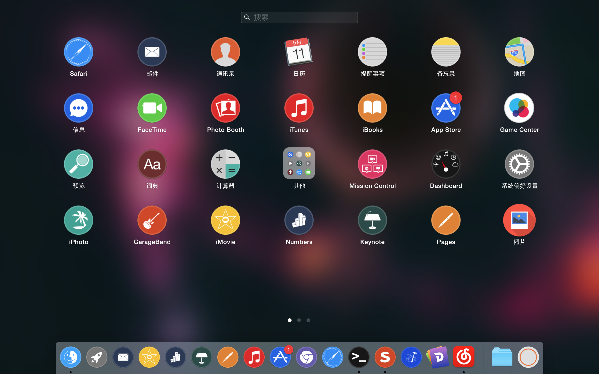
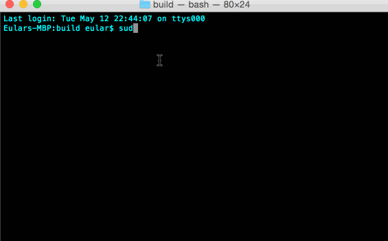
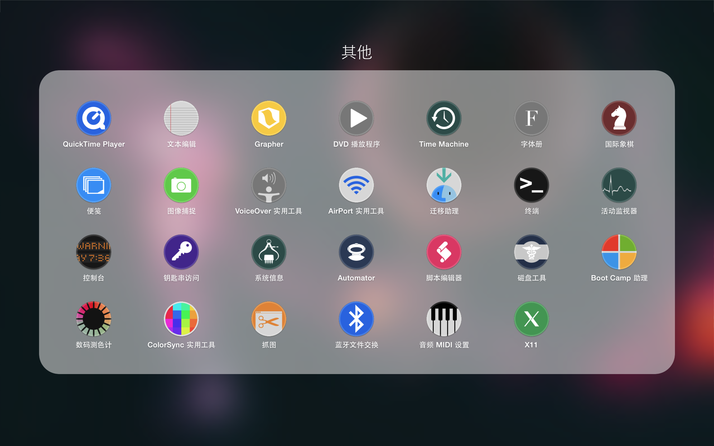
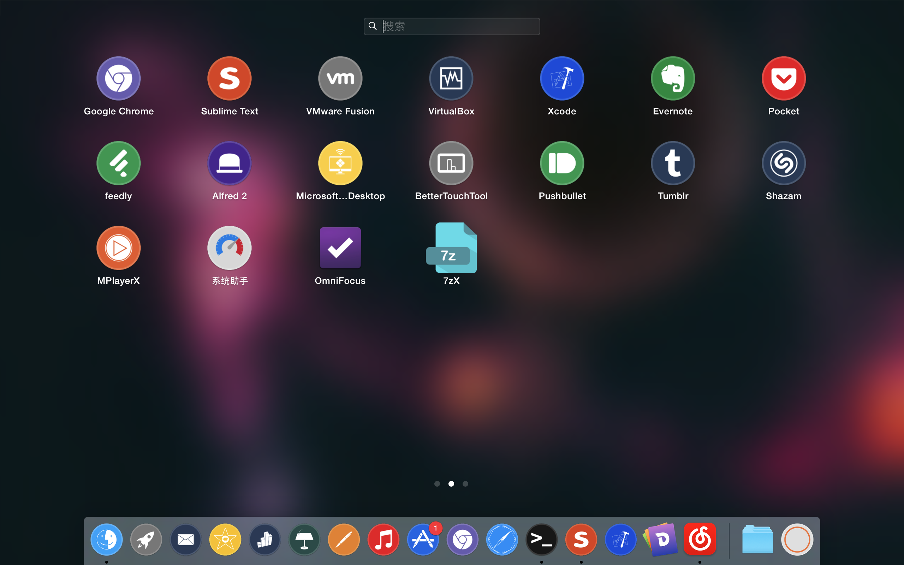
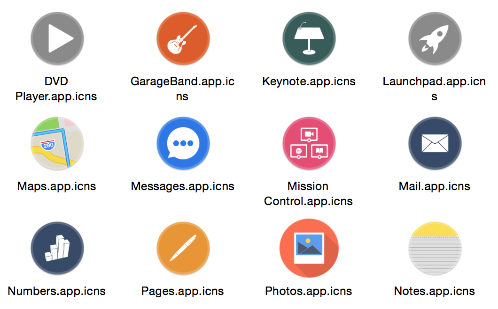

# Iconista

Learn more at http://urinx.github.io/app/iconista/

The best & most beautiful way to set your Mac OS X beautiful!



What
----
It's easy, save, and fast tool that helps you to change your Mac Os X default applications icon, for it looks like horrible and ugly.

Which can do the followings:
* Replace the system applications icon with default themes
* Replace the some third part apps icon
* Set the files or folders icon
* Set the wallpaper

El Capitan
----------
> In OS X 10.11(El Capitan) and up, Apple add a new 'Rootless' feature -- System Integrity Protection(SIP).
> 
> SIP is protecting the core apps which OS X installs into Applications and Applications Utilities. This means it will no longer be possible to change the applications which OS X installs, even from the command line when using root privileges.
> 
> You can find all protected directories in /System/Library/Sandbox/rootless.conf
> 
> So we cant change the icon of core apps in Applications and Applications Utilities.
> 
> **Or:**
> 
> If you really want to change the default apps icon, you can disable SIP. Currently this requires rebooting into recovery mode and running the command `csrutil disable`.

Install
-------
Download the soure code and then unzip it.
```
git clone https://github.com/Urinx/Iconista/archive/master.zip
```
Go to `build` folder, and `Iconista` is the main program.
```
cd build/
sudo ./Iconista
```
That's all, it's very easy, right?

How
---
For help, you can do this:
```
sudo ./Iconista -h
```
Install the default icon theme:
```
sudo ./Iconista -i
```
Restore the origin system icon:
```
sudo ./Iconista -r
```
Delete/hide the app in Launchpad:
```
sudo ./Iconista -d "Safari"
```
Set icon for file or folder:
```
sudo ./Iconista -f /path/to/file /path/to/icon
```
Install the specified theme:
```
sudo ./Iconista -s "theme_name"
```
If you disable the SIP, you can change the icon of apps which OS X installs:
```
sudo ./Iconista -i -rootless
```

Demo
----


Screenshots
-----------




Themes
------
There is only a default theme for now, but more themes will be added in the furtrue.



The icon of default theme is come from [BlackVariant (Patrick)](http://blackvariant.deviantart.com), free for non-commercial use.

License
-------
> Copyright (C) 2013-2015 Eular <uri.lqy@gmail.com>
> Licensed under the Apache License, Version 2.0 (the "License");
